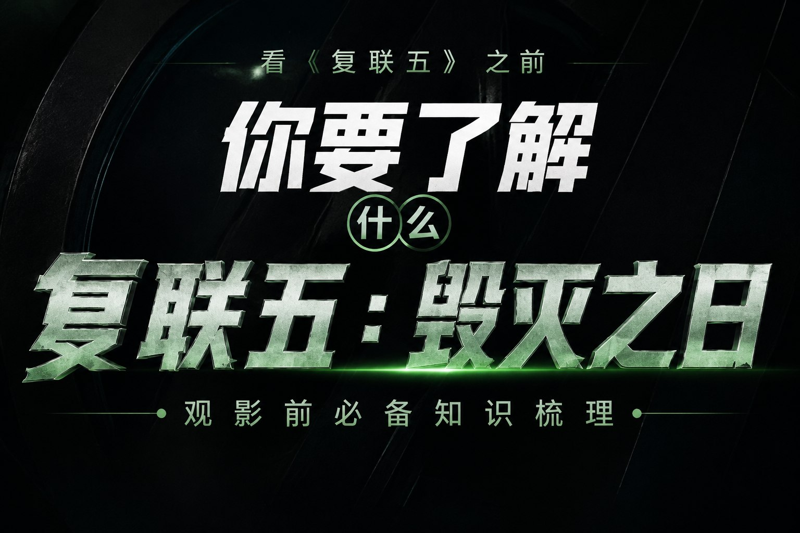

# 《复仇者联盟5:毁灭之日》观影指南 · 看复联五前,你需要了解什么

> 一个纯静态、零依赖的中文漫威观影指南网站:把漫威 40 多年、跨 6 家片方的全部影视作品一次理清,并逐部告诉你**它讲了什么**、以及**它跟《复仇者联盟5:毁灭之日》有什么关系**;再配上预告确认登场与预测登场角色的完整人物介绍,以及一个带声明与管理的留言提问板。

**🌐 在线访问(公网,任何人可打开):** <https://k53689649-lab.github.io/avengers-doomsday/>
**📦 源码仓库:** <https://github.com/k53689649-lab/avengers-doomsday>

> 站点结构:首页 `index.html` 是**封面门户页**,提供「进入前瞻」与「留言提问板」两个入口;
> 前瞻主站是 `guide.html`,留言板是 `comments.html`。

---

## 🚪 门户首页



- 全屏海报式布局:封面图作为主体(图片自带标题文字),下方接**上映倒计时**与两个入口
- **北美上映倒计时**(2026-12-18,自动计算天/时/分/秒)
- 两个大入口:**进入前瞻** / **留言提问板**
- 封面可换:替换 `assets/img/cover.jpg` 即可(建议 1536×1024 以上);删除后会回退到原创 SVG 插画 `assets/img/cover.svg`
- 移动端自适应(小屏时封面自动缩放完整显示,不会裁掉标题)

---

## 📖 项目简介

《复仇者联盟5:毁灭之日》不是一部"单独的电影"——它是从 1986 年《霍华德鸭》一路累积到今天的漫威改编史的总汇总:复仇者、X战警、神奇四侠、瓦坎达、雷霆特工队、老版刀锋与艾丽卡……全都要在同一部片子里见面。

问题在于:**信息太散了。** 大多数"补课清单"只列片名,不说这些片子到底讲了什么、为什么非看不可;大部分"角色介绍"只讲漫画设定,不管电影里现在是什么状态。

于是有了这个站点:

- **给想快速补课的人**:三条不同强度的补课路线(3 天速通 / 主线完整 / 全宇宙硬核),外加"关联度"标签一键筛选。
- **给怕漏细节的人**:103 条作品条目、23 位预告确认角色、7 位预测角色、5 条最新彩蛋速报,全部标注信息来源与可信度。
- **给想提问的人**:留言提问板,带完整的发言规范声明、站长公告、以及站长的删评 / 置顶 / 回复管理功能。

---

## ✨ 功能特性

### 主站(`index.html`)

| 模块 | 说明 |
|---|---|
| 🎬 电影速览 | 上映日期、导演、编剧、核心反派、官方卡司规模、三大宇宙等关键信息一屏看全 |
| 🥚 **彩蛋速报** | 《复联4加码臻享版》4 个复联5彩蛋 + 《蜘蛛侠4》凤凰女揭示,逐条解读与复联5的关系 |
| 🗺️ 观影路线 | 速通路线(12 部)/ 漫威影业主线 / 全宇宙硬核版,点击切换 |
| 📚 全作品库 | 103 条作品(88 部电影 + 15 部精选剧集),支持**关键词搜索** + **出品方 / 关联度 / 上映状态**三重筛选 |
| 🦸 预告确认角色 | 24 位:从毁灭博士、美队史蒂夫、洛基、X教授、万磁王、镭射眼,到瓦坎达阵营、纳摩、蚁人、浩克、雷霆特工队 |
| 🔮 预测角色 | 7 位:三代蜘蛛侠、奇异博士、死侍、金刚狼、绯红女巫等,标注依据与登场概率 |
| ❓ Q&A | 7 条观影前高频问题(为什么唐尼演 Doom、康去哪了、三宇宙是哪三个…) |

### 留言板(`comments.html`)

| 功能 | 说明 |
|---|---|
| 📢 留言须知 | 12 条扩充版声明:站点性质、友善交流、剧透规范、违法内容禁止、刷屏拦截规则、广告导流禁止、版权、隐私保护、内容处置权、技术说明与举报渠道 |
| 📌 站长公告 | 置顶展示,站长可在管理面板发布 |
| 💬 留言/提问 | 昵称 + 类型(提问/剧情考据/观后感/纠错)+ 内容,4-500 字 |
| 🛡️ 防刷机制 | 30 秒冷却、单次访问 20 条上限、重复内容拦截、敏感词过滤、纯重复字符拦截 |
| 🔑 微信 / QQ 登录入口 | 按配置状态给出说明与替代方案(见下方"留言板部署指南") |
| 🧑‍💼 站长管理 | 密码解锁后可:**发布公告、置顶/取消置顶、回复留言、删除留言、导出 JSON 备份、清空留言** |
| ☁️ 云端模式 | 填入 Waline 服务地址后自动切换为云端留言板(多端同步 + 社交登录 + 官方后台) |

---

## 🗂️ 目录结构

```
marvel-doomsday-prep/
├── index.html                    # 门户首页(封面 + 倒计时 + 两个入口)
├── guide.html                    # 前瞻主站(全部作品 / 角色 / 彩蛋 / 路线 / FAQ)
├── comments.html                 # 留言提问板
├── 门户页-单文件版.html            # 构建产物:门户单文件版(可直接分享)
├── 复仇者联盟5观影指南-单文件版.html   # 构建产物:主站单文件版
├── 留言提问板-单文件版.html          # 构建产物:留言板单文件版
├── serve.mjs                     # 本地静态服务器
├── build-single-file.mjs         # 单文件版构建脚本
├── push-to-github.mjs            # API 推送脚本(本机 git 直连被拦截时使用)
├── smoke-test.mjs                # 冒烟测试(改完数据跑一遍)
├── docs/
│   └── github-pages-workflow.yml # GitHub Actions 部署模板(可选)
├── README.md / LICENSE
└── assets/
    ├── css/
    │   ├── portal.css            # 门户首页样式(封面 / 倒计时 / 入口卡片)
    │   ├── style.css             # 主站样式(深色漫威风 / 响应式)
    │   └── comments.css          # 留言板样式
    ├── img/
    │   └── cover.svg             # 原创概念封面插画(可替换为 cover.jpg 官方海报)
    └── js/
        ├── data-films.js         # 88 部影片 + 15 部剧集 + 5 条彩蛋速报数据
        ├── data-characters.js    # 23 位确认角色 + 7 位预测角色
        ├── app.js                # 主站渲染逻辑(搜索 / 筛选 / 路线 / FAQ / 彩蛋)
        ├── site-config.js        # ⚙️ 站点配置(管理密码、Waline 地址、发言限制、敏感词)
        └── comments.js           # 留言板逻辑(存储 / 校验 / 管理 / Waline 集成)
```

### 换成自己的封面

把官方海报或自制封面保存为 **`assets/img/cover.jpg`** 即可 —— 页面会优先使用它,加载失败才回退到原创 SVG 插画。封面建议尺寸 1600×900 以上的横图。


---

## 🚀 本地运行

不需要任何依赖与构建步骤,三种方式任选:

```bash
# 方式一:直接双击 index.html(部分浏览器对本地 localStorage 有限制,建议用方式二)

# 方式二:Node 内置服务器(推荐)
node serve.mjs                 # 默认 http://localhost:8901/
PORT=9000 node serve.mjs       # 换端口

# 方式三:Python
python -m http.server 8080
```

> Windows PowerShell 里设端口:`$env:PORT=9000; node serve.mjs`

### 重新生成单文件版

修改内容后执行:

```bash
node build-single-file.mjs
```

会同时输出两个可直接微信/邮件发送的单文件 HTML(所有 CSS/JS 已内联,对方双击即看)。

### 自检

```bash
node smoke-test.mjs
```

内置 18 项冒烟测试:用最小 DOM 桩验证主站渲染数量、彩蛋条目、角色分区是否正确,以及留言板的校验规则(广告拦截、重复刷屏拦截)、渲染与公告功能 —— 改完数据跑一遍就知道有没有改坏。

### 把更新推送到 GitHub

若本机到 `github.com:443` 的直连被网络环境拦截(`git push` 报 "Failed to connect"),可以用内置的 REST API 推送脚本:

```powershell
$env:GH_TOKEN="ghp_你的令牌"      # 经典令牌勾选 public_repo 即可
node push-to-github.mjs
```

它会读取当前目录全部文件(忽略 `.git`/`node_modules`),按 UTF-8 生成一次提交推到 `main`。中文文件名与中文内容都能正确处理。

> 想启用 GitHub Pages:仓库里已附模板 [`docs/github-pages-workflow.yml`](docs/github-pages-workflow.yml),把它复制成 `.github/workflows/pages.yml` 即会自动部署(在 GitHub 网页上新建文件即可,无需本地 git)。

---

## ☁️ 部署

### 方案一:Netlify Drop(最省事,当前线上版本就是这样部署的)

1. 打开 <https://app.netlify.com/drop>
2. 把整个 `marvel-doomsday-prep` 文件夹拖进去
3. 秒出网址,例如 `https://elegant-custard-c65320.netlify.app/`

### 方案二:GitHub Pages

```bash
git init
git add .
git commit -m "feat: 复联5观影指南站点"
git branch -M main
git remote add origin https://github.com/<你的用户名>/<仓库名>.git
git push -u origin main
# 然后在仓库 Settings → Pages 里选择 main 分支根目录
```

### 方案三:Vercel / Cloudflare Pages

均为"导入 Git 仓库 → 无需构建命令 → 输出目录填 `.`"即可。

---

## 💬 留言板部署指南

留言板有三种工作模式,按需要选:

### 模式 A:本地存储模式(默认,零配置)

- 留言保存在访客自己的浏览器 `localStorage` 里。
- **适合**:自用、演示、先跑起来看看效果。
- **注意**:其他访客看不到你的留言,你发的留言别人也看不到。

### 模式 B:Waline 云端模式(推荐,免费)

Waline 是主流的"无服务器评论系统":数据存云数据库,逻辑跑在免费 Serverless 上,自带后台管理。

1. **建数据库**:注册 [LeanCloud 国际版](https://console.leancloud.app/) 或 [Supabase](https://supabase.com/) 免费版,拿到 AppID / AppKey(或 URL / Key)。
2. **部署服务端**:用 [Waline 官方 Vercel 一键部署](https://waline.js.org/guide/deploy/vercel.html)(点一下按钮 → 填环境变量 → 得到形如 `https://xxx.vercel.app` 的地址)。
3. **填写配置**:打开 `assets/js/site-config.js`,把地址填进:

   ```js
   walineServerURL: "https://你的-waline地址.vercel.app",
   ```

4. 刷新页面:留言板会自动切换为云端模式(本地表单隐藏,Waline 留言框出现),所有访客共享同一份留言。

**收益**:所有人可见、多端同步、支持社交登录、官方管理后台可回复与删评、支持邮件/微信通知。

### 模式 C:Twikoo 自建(喜欢自己掌控数据时)

部署 [Twikoo](https://twikoo.js.org/) 服务端,再把其前端容器嵌入页面即可,思路与 Waline 相同。

### ⚠️ 关于"微信登录 / QQ 登录"的重要说明

这是很多站长的误区,先说清楚:

- **微信网站扫码登录**需要「微信开放平台 - 网站应用」资质,**必须企业/组织主体 + 300 元/年认证费**,个人开发者无法申请,且网站需具备 ICP 备案信息。
- **QQ 互联(网站应用)**同样要求企业/组织主体认证,个人开发者无法开通。
- 因此:**纯个人站点几乎不可能直接做出"微信/QQ 一键登录"的留言板**(除非借用公众号/小程序体系或第三方已认证平台)。

**可行的替代方案(按推荐度排序):**

1. **不登录的匿名留言**:设置昵称即可发言(本站默认模式),配验证码防刷 —— 对影迷交流板来说通常完全够用。
2. **Waline 社交登录**:服务端可开启 GitHub / 微博 / QQ 等社交登录(具体支持项取决于 Waline 版本与配置),用户体验接近"一键登录"。
3. **邮箱注册登录**:Waline / Twikoo 都支持邮箱验证码注册,无需任何第三方资质。
4. 若你有企业主体与已备案域名,再按官方流程申请微信开放平台 + QQ 互联,配置到 Waline 的社交登录中;届时把 `site-config.js` 里的 `socialLogin: { wechat: true, qq: true }` 打开即可。

> 页面上的「微信登录 / QQ 登录」按钮会依据配置状态弹出对应说明,不会给访客留下"点了没反应"的困惑。

### 🧑‍💼 站长管理怎么用

1. 打开留言板页面 → 右上角「**站长管理**」。
2. 输入密码解锁(默认密码在 `assets/js/site-config.js` 的 `adminPassword`,**请务必修改**)。
3. 解锁后每个留言下方会出现「置顶 / 回复 / 删除」按钮;面板里可以发布公告、导出 JSON 备份、清空留言。

> 🔒 **安全提示**:这是纯前端密码,只用于挡住普通访客,不能防技术型攻击。正式运营请使用 **Waline 官方的服务端后台** 做管理与鉴权(数据库层面安全),前端密码只当"防误触"用。

---

## ✍️ 内容更新指南

| 想改什么 | 改哪个文件 | 怎么改 |
|---|---|---|
| 新增/修改电影条目 | `assets/js/data-films.js` 的 `FILMS` 数组 | 照抄一条改 `title / year / studio / plot(讲了什么) / relation(与复联5的关系) / rel(关联度)` |
| 新增剧集 | 同文件 `TV_SHOWS` 数组 | 同上,`rel` 决定标签颜色 |
| 更新彩蛋速报 | 同文件 `EASTER_EGGS` 数组 | 每项含 `n / title / film / text / rel` |
| 角色加入或移出阵容 | `assets/js/data-characters.js` | 把条目在 `TRAILER_CHARS`(确认)与 `PREDICTED_CHARS`(预测)之间移动即可 |
| 改管理密码 / 留言限制 / 敏感词 | `assets/js/site-config.js` | 改完刷新即生效 |

**关联度标签含义**:`direct` 直接相关(红) / `context` 重要背景(蓝) / `minor` 一般关联(紫) / `info` 番外(绿)。
**角色可信度标签**:`official` 预告确认 / `cast` 官方官宣 / `rumor` 传闻推测(附登场概率与依据)。

---

## 🔍 内容严谨性说明

- 站内所有条目都带有**可信度标注**:官方确认 / 官方官宣 / 媒体传闻 / 理论推测,分开呈现,不混为一谈。
- 存在媒体版本分歧的细节(例如某一角色是否出现在某支预告的具体镜头、暴风女是否入镜、三代蜘蛛侠是否同框),站内**并列呈现双方说法**并注明"以正片为准",不做单方面断言。
- 主要内容来源:
  - 官方:[Marvel 官网《复仇者联盟5:毁灭之日》页面](https://www.marvel.com/movies/avengers-doomsday)、SDCC 2024 / D23 卡司公布
  - 预告解析:[TheGamer 全员盘点](https://www.thegamer.com/avengers-doomsday-trailer-every-character/)、[Den of Geek breakdown](https://www.denofgeek.com/movies/avengers-doomsday-trailer-breakdown-doctor-doom-x-men-captain-america-returns/)、[Variety(X战警回归)](https://variety.com/2026/film/news/x-men-avengers-doomsday-teaser-cyclops-xavier-magneto-1236623852/)、[IGN(瓦坎达/石头人)](https://s.ign.com/articles/new-avengers-doomsday-trailer-officially-released-shows-shuri-as-black-panther-mbaku-namor-and-the-thing-from-the-fantastic-four)、[Polygon](https://www.polygon.com/avengers-doomsday-trailer-2-marvel-d23/)、[17173 出场英雄汇总](https://news.17173.com/content/07212026/090159595.shtml)
  - 缺席名单与其他:[Forbes](https://www.forbes.com/sites/hannahabraham/2026/07/20/spiderman-doctor-strange-and-more-avengers-missing-from-the-first-doomsday-trailer/)、[Gulf News(蜘蛛侠疑问)](https://gulfnews.com/entertainment/avengers-doomsday-trailer-has-no-spider-man-confirmation-is-tom-holland-really-sitting-this-one-out-1.500614768)
- 站内还包含由站长提供的**影院一手信息**(《复联4加码臻享版》四个彩蛋、《蜘蛛侠4》凤凰女揭示),已在条目中如实标注出处场景。

---

## ⚠️ 免责声明

- 本项目为**非官方粉丝整理内容**,与漫威影业、迪士尼、索尼影业、20世纪福克斯等公司**无任何隶属或合作关系**。
- 站内影片信息、票房、剧情推测整理自公开报道与上映内容,可能存在滞后或偏差,**最终请以官方公布与电影正片为准**;预测与传闻内容已明确标注,不构成观影指导承诺。
- Marvel、Avengers 及相关角色、影片名称、海报等版权归 **Marvel Studios / Disney** 等权利方所有;本项目仅用于学习、交流与影迷补课用途,不作商业使用。
- 留言板内容由访客自行发布,不代表本站立场;站长保留删除违规内容与追究相关责任的权利。

## 📄 License

- **代码部分**(HTML/CSS/JavaScript/构建脚本):MIT License,可自由使用、修改与分发,保留出处即可。
- **文字内容部分**(影片简介、角色介绍、彩蛋解读等原创整理文字):CC BY-NC-SA 4.0,转载请注明来源,禁止商业使用。

---

<div align="center">

**如果这个站点帮你理清了漫威的千头万绪,欢迎在留言板留下一句「已补课完毕」 🎬**

《复仇者联盟5:毁灭之日》2026 年 12 月 18 日北美上映 —— 到时候见。

</div>
